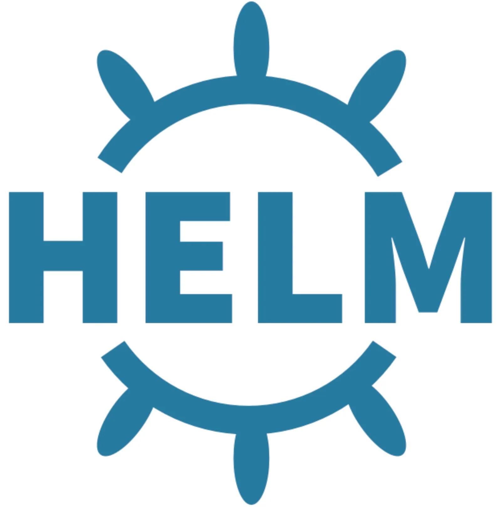

# About Me

Hi there! 👋 I'm Wesal Eldesouky, a dedicated and passionate devops Engineer. With a keen eye for detail and a knack for problem-solving, I thrive in dynamic work environments where challenges are opportunities for growth. I am committed to delivering high-quality results while ensuring efficiency and adherence to project timelines.

## Tools I Use

Here are some of the key tools I utilize in my work:

 

## Contact Me

I'm always eager to connect and discuss potential collaborations or opportunities. Feel free to reach out to me via [email/LinkedIn/other contact information] to start a conversation!

]
